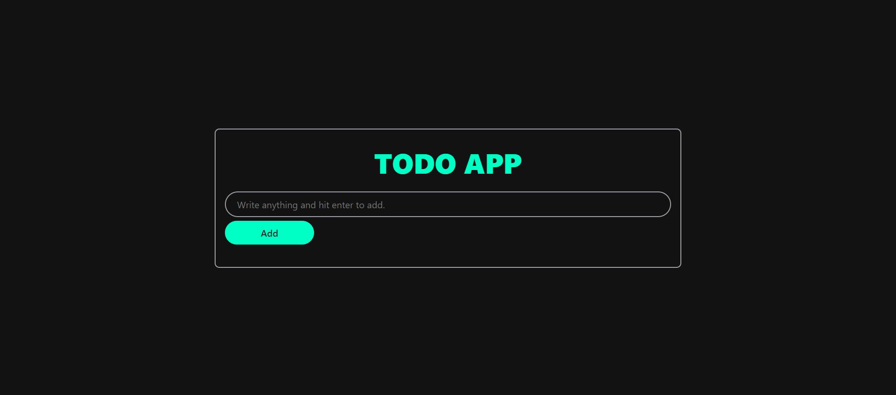
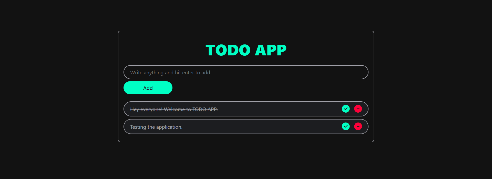

# Todo-Application 📝

A simple and intuitive ToDo application built with Spring Boot and Thymeleaf, 
allowing users to manage their tasks efficiently. This application supports adding, editing, and deleting tasks,
as well as marking tasks as completed. Designed for easy use, with a responsive UI powered by Thymeleaf templates.

<strong>Features:</strong>

<ul style="list-style-type: decimal">
    <li>CRUD functionality for tasks</li>
    <li>Task completion status updates</li>
    <li>User-friendly interface with Thymeleaf</li>
    <li>Lightweight and efficient Spring Boot backend</li>
</ul>
<strong>Tech Stack</strong>: Spring Boot, Thymeleaf, HTML/CSS, MySQL
 
Note: Improvements to be done.
 

